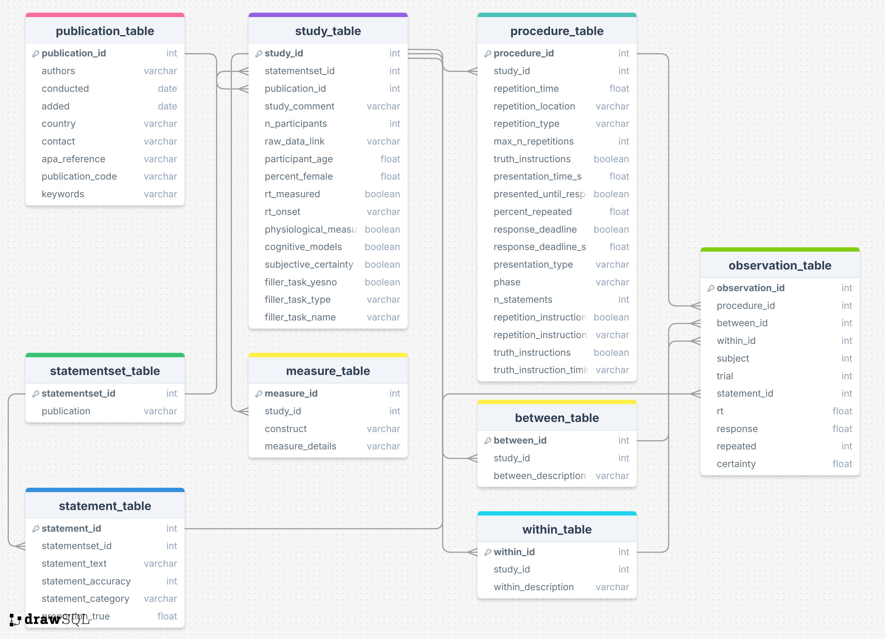

# Truth Effect Database (TED)

Welcome to the Truth Effect Database (TED) — a large, open-source repository dedicated to research on the illusory truth effect.
TED currently contains: 50+ Studies, 10.000+ Participants, 500.000+ Trials

You can find more information on TED at its website: https://slesche.github.io/ted-site/

## The database
The database contains multiple tables, each dedicated to storing information of a particular aspect of truth effect research. For example, the *study_table* contains information on the studies published, such as the number of participants. The *procedure_table* contains important information on the procedure of the experiment, such as the delay between exposure and judgment phase. And the *observation_table* contains the raw data. You can find out more information on all available variables here: https://slesche.github.io/ted-site/get-started.html



## Submitting Data
We welcome new submissions of published and unpublished data! To guide you through the submission process, we have prepared a website:

https://slesche.github.io/truth-effect-database/

Feel free to [reach out](https://slesche.github.io/ted-site/contact.html) to us with any additional questions!

## Extracting data
The Truth Effect Database (TED) is an open resource built for researchers investigating the illusory truth effect.
We place no restrictions on usage — feel free to explore, analyze, and publish with it.

Please remember:
🔔 All studies used in your final dataset must be cited individually.

To work with TED, download `ted.db` from this repository: [Link](ted.db)

You can then use any SQL tool to interact with the database.

In order to enable all users to interact with TED, we have built an R-package to aid extraction from the database: [`acdcquery`](https://github.com/SLesche/acdc-query)

This package provides functions to connect with the database, define filter arguments, and extract data from TED:

```R
library(acdcquery)

conn <- connect_to_db("path/to/ted.db")

arguments <- list() %>% add_argument(
    conn = conn,
    variable = "publication_id", # You can use any variable name from TED, no need to specify its table
    operator = "greater",
    values = 0
  ) %>%
  add_argument(  # You can chain together multiple arguments
    conn = conn,
    variable = "phase", # You can use any variable name from TED, no need to specify its table
    operator = "equal",
    values = "test"
  )

procedure_results <- query_db(
  conn = conn,
  arguments = arguments,
  target_vars = c("default", "publication_id"), # "default" will automatically return all vars in "target_table"
  target_table = "procedure_table"
)

trial_results <- query_db(
  conn = conn,
  arguments = arguments,
  target_vars = c("default", "phase"), # You can add any variable from any table to be added to the result
  target_table = "observation_table"
)
```
